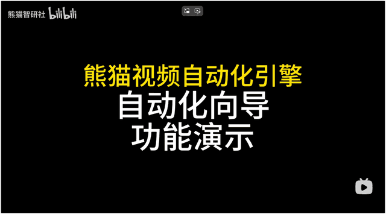
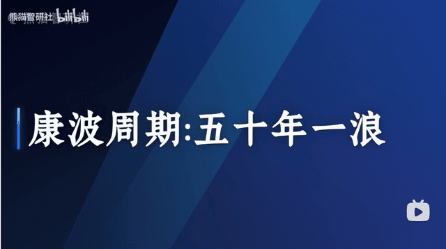
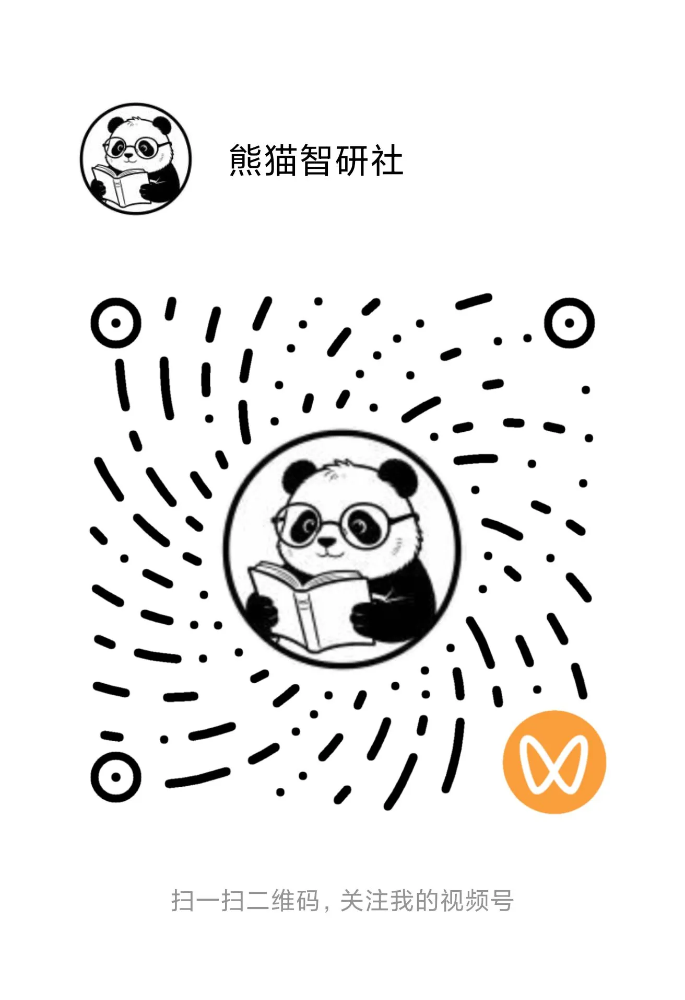

<div align="center">
  
  
  # Panda Video Generator
  
  **熊猫视频自动化引擎**

  *"Developer-first video automation engine."*

  [](LICENSE)
  [](https://www.typescriptlang.org/)
  [](https://nextjs.org/)
  [](https://www.remotion.dev/)
</div>

---

<div align="center" style="margin: 12px 0 20px;">
  <a href="https://panda.szhshp.org" title="Panda Video Generator 官方网站" style="display: inline-block; padding: 12px 28px; border: 2px solid #0969da; border-radius: 8px; font-weight: 700; font-size: 1.05em; text-decoration: none; color: #0969da;">官方网站</a>
</div>

## ✨ 核心特性

<!-- GitHub.com strips most flex/gap inline styles; use a plain row table so 3 columns match on the website. -->
<table cellspacing="20" cellpadding="0" border="0">
  <tr valign="top">
    <td width="34%" valign="top">
      <h3>🕷️ <mark>一键</mark>网页转文本</h3>
      <p>一键抓取正文与标题（如知乎），输出结构化文件，少手工整理。</p>
    </td>
    <td width="33%" valign="top">
      <h3>🎬 <mark>一键</mark>文本转视频</h3>
      <p>一键跑通口播链路：Edge TTS + VTT 字幕，Remotion 模板渲染成片。</p>
    </td>
    <td width="33%" valign="top">
      <h3>🚀 <mark>一键</mark>多平台发布</h3>
      <p>一键驱动浏览器自动化上传；B 站、抖音、视频号、YouTube、小红书、快手等共用相近流程。</p>
    </td>
  </tr>
</table>

## 接入方式

<table cellspacing="20" cellpadding="0" border="0">
  <tr valign="top">
    <td width="34%" valign="top">
      <h3>🤖 1. Agent Skills 方式</h3>
      <ul>
        <li>使用 AI Agent 编排视频生成与发布流程。</li>
        <li>支持口播流水线、爬虫、TTS、渲染与发布等技能。</li>
        <li>支持 Cursor、Claude Code、Copilot 等常用 AI Agent。</li>
      </ul>
      <p><a href="#agent-skills">查看更多 →</a></p>
    </td>
    <td width="33%" valign="top">
      <h3>🧭 2. 网页端自动化向导方式</h3>
      <ul>
        <li>通过傻瓜式 <a href="#wizard-automation">自动化向导</a>，无需手写命令。</li>
        <li>在浏览器中按步骤完成文稿、TTS 与成片渲染。</li>
        <li>多平台发布为可选步骤，可按需执行。</li>
      </ul>
      <p><a href="#wizard-automation">查看更多 →</a></p>
    </td>
    <td width="33%" valign="top">
      <h3>🔄 3. GitHub Actions</h3>
      <ul>
        <li>使用 GitHub Actions 在云端跑通抓取、TTS 与 Remotion 渲染。</li>
        <li>无需在本地安装依赖或常驻服务。</li>
        <li>Fork 后配置密钥与变量即可触发工作流，本地几乎不用折腾。</li>
      </ul>
      <p><a href="./.github/workflows/generate-video.yml">查看更多 →</a></p>
    </td>
  </tr>
</table>

---

## 📖 简介

**Panda Video Generator**（熊猫视频自动化引擎）

一站式全自动化的视频内容生成与发布引擎，支持从网页内容提取、文本转视频到多平台发布的完整工作流。通过 AI 驱动的文本转语音（TTS）技术和视频渲染引擎，帮助内容创作者快速生成高质量视频并一键发布到多个平台。

## ❇️ 功能演示1 - Agent 使用演示

> 《用 AI 的方式一人运营十个自媒体账号》


<a href="https://www.bilibili.com/video/BV1WXDABGEB7/?vd_source=a7353d3395fdf5c1b78e0a2367800f20">
  
</a>


## ❇️ 功能演示2 - 网页自动化向导

> 《用程序员的方式一人运营十个自媒体账号》

<a href="https://www.bilibili.com/video/BV141XfB3ELj/?vd_source=a7353d3395fdf5c1b78e0a2367800f20">
  
</a>


## 🎉 成品展示

<a href="https://www.bilibili.com/video/BV1ZnDcBsEK7/">
  
</a>


<a href="https://www.bilibili.com/video/BV19Rw9zwEd4/">
  
</a>


<a id="changelog"></a>
## 📅 更新日志

- **V1.3.1** · 2026-04-05
  - 支持 KIMI
- **V1.3** · 2026-04-03
  - YES, SKILLS! 
  - Why not try it in your OpenClaw? 🦞
- **V1.2** · 2026-04-01
  - 添加了自动化向导功能，通过鼠标傻瓜式点击就能帮忙完成文稿、TTS、渲染、发布全流程。
  - 统一了环境变量名称，全部环境变量放在 `.env`。


## 📷 平台示例

> 看看开发者上传的几百个视频成品吧~

<table>
  <tr>
    <td align="center" valign="top" width="33%">
      
    </td>
    <td align="center" valign="top" width="33%">
      
    </td>
    <td align="center" valign="top" width="33%">
      
    </td>
  </tr>
  <tr>
    <td align="center" valign="top" colspan="3">
      
      &emsp;&emsp;
      
    </td>
  </tr>
</table>

---

<a id="quick-start"></a>
## 🚀 快速开始

> 如果你有一个 AI Agent (Claude Code, Cursor, Copilot 等)，可以阅读本仓库的 README、`docs/readme/` 分册以及 **[`.agent/skills`](./.agent/skills)** 下的 Agent Skills，在完成环境配置后驱动 Setup 与视频发布全流程。


1. **[环境配置（必须）](#env-setup)**
   - Node 20+、ffmpeg、克隆仓库、安装依赖。
   - `pnpm check:setup` 自检；`cp .env.example .env` 并按分组填写（见 [环境配置](#env-setup)）。
2. **[方式1: 自动化向导](#wizard-automation)**（**推荐新手**）
   - 根目录 `pnpm automation`，浏览器内按步操作。
   - 不确定从哪开始时优先用这个。
3. **[方式2: Agent Skills](#agent-skills)**
   - 技能定义：**[`.agent/skills`](./.agent/skills)**（各包 `SKILL.md`）。
   - 建议先读 [CLI 使用指南](./docs/readme/cli-usage-guide.md)、[分步说明](./docs/readme/step-by-step.md)，再让 Agent 调脚本。
4. **[方式3: CLI 命令行](./docs/readme/cli-usage-guide.md)**
   - 与向导相同底层命令，适合终端与自动化脚本。
   - 需配置根目录 **`.env`**（口播、TTS、发布等）。
5. **[完整工作流示例](./docs/readme/full-workflow.md)**
   - 知乎链路到成片、多平台发布的命令示例合集。


<a id="env-setup"></a>
## 📦 环境配置

### 1. 环境要求

- 安装 **[Node.js 20+](https://nodejs.org/)**（≥ 20.9）。
- **ffmpeg**：须为系统安装并在终端 `PATH` 中（TTS 合并音频等依赖）。
  - macOS：`brew install ffmpeg`
  - Ubuntu：`sudo apt install ffmpeg`
  - Windows：
    - `choco install ffmpeg`（需要管理员权限）
    - 或 [ffmpeg 官网](https://ffmpeg.org/download.html) 下载并配置环境变量

### 2. 获取代码

```bash
git clone https://github.com/szhshp/panda-video-generator.git
cd panda-video-generator
```

### 3. 一键安装

- **推荐：** `pnpm install:project`
- **手动运行：**
  - macOS / Linux：`bash scripts/install.sh`
  - Windows：`powershell -ExecutionPolicy Bypass -File scripts/install.ps1`

### 4. 验证与配置

- 自检：`pnpm check:setup`
- `cp .env.example .env`，需要提供环境变量

---

<a id="wizard-automation"></a>
## 🧭 自动化向导

用浏览器完成 **文稿 → TTS → 成片渲染 → 发布（可选）**，无需手写命令。

### 怎么用来着?

1. 完成 [环境配置](#env-setup)
2. 在**项目根目录**执行 **`pnpm automation`**。
3. 浏览器自动打开向导。
4. 按步骤完成：**文稿 → TTS → 成片渲染 → 发布（可选）**。
5. 问题反馈：[Issue](https://github.com/szhshp/panda-video-generator/issues)。

---

<a id="agent-skills"></a>
## 🤖 Agent Skills 方式

在已完成 [环境配置](#env-setup) 的前提下，让使用的 AI 工具加载 **[`.agent/skills`](./.agent/skills)** 中的技能说明（例如口播流水线、爬虫、TTS、渲染与发布）。技能文件描述输入输出、命令与环境变量，可与根 README、[CLI 使用指南](./docs/readme/cli-usage-guide.md)、[分步文档](./docs/readme/step-by-step.md) 对照使用。


---

## 📚 CLI 使用指南

命令行（CLI）示例与输出目录见 **[CLI 使用指南](./docs/readme/cli-usage-guide.md)**；其它分册见 **[文档索引](./docs/readme/README.md)**。

---

<a id="development"></a>
## 🔧 开发

### 启动 Remotion Studio

```bash
pnpm remotion
```

---

<a id="feature-status"></a>
## 📋 功能状态

```
功能模块
├── ✅ 自动化向导
├── 🕷️ 网页内容提取
│   ├── ✅ 理论上支持所有公共网页内容提取
│   ├── ✅ 知乎内容 + 问答特殊处理
│   ├── 🚧 HackerNews 总结+处理
│   ├── 🚧 Quora 内容提取
│   ├── 🚧 Reddit 内容提取
│   └── 🚧 And More...
├── 🤖 总结与优化（LLM）
│   ├── ✅ DeepSeek
│   ├── ✅ Kimi / Moonshot
│   ├── 🚧 Doubao
│   ├── 🚧 Qwen
│   ├── 🚧 Hunyuan
│   ├── 🚧 ChatGLM / GLM
│   ├── 🚧 MiniMax
│   └── 🚧 And More...
├── 🎬 文本转视频
│   ├── ✅ 自动生成语音和字幕（TTS）
│   ├── ✅ 自动渲染视频
│   └── ✅ 视频模板系统 
│       ├── ✅ 横屏模板
│       ├── ✅ 竖屏模板
│       ├── ✅ 你可以自由修改视频模板的任何细节
│       └── 🚧 更多模板...
├── 🎞️ **视频素材**
│   ├── ✅ 自定义音乐
│   ├── 🚧 AI 生成音乐
│   ├── ✅ 自定义背景
│   └── 🚧 AI 生成背景
├── 🚀 多平台发布
│   ├── ✅ Bilibili 自动发布
│   ├── ✅ 抖音自动发布
│   ├── ✅ 微信视频号自动发布
│   ├── ✅ 小红书自动发布
│   ├── ✅ YouTube 自动发布
│   ├── ✅ 快手自动发布
│   └── 🚧 And More...
├── 🔧 开发工具
│   ├── ✅ 开发服务器
│   └── ✅ GitHub Actions 自动化视频生成（知乎链路至成片）
├── 🧩 AI Integration
│   └── ✅ Agent Skills
├── 🦞 OpenClaw Integration
│   └── 🚧 更多适配
└── ✨ And More...


```

---

## 🤝 贡献

欢迎提交 Issue 和 Pull Request！

---

## 📄 许可证

本项目采用 MIT 许可证。详见 [LICENSE](LICENSE) 文件。

---

## 👤 作者

**szhshp**

- Email: 24031shp@sina.com
- GitHub: [@szhshp](https://github.com/szhshp)

---

<div align="center">
  Made with ❤️ by szhshp x 熊猫智研社
</div>
